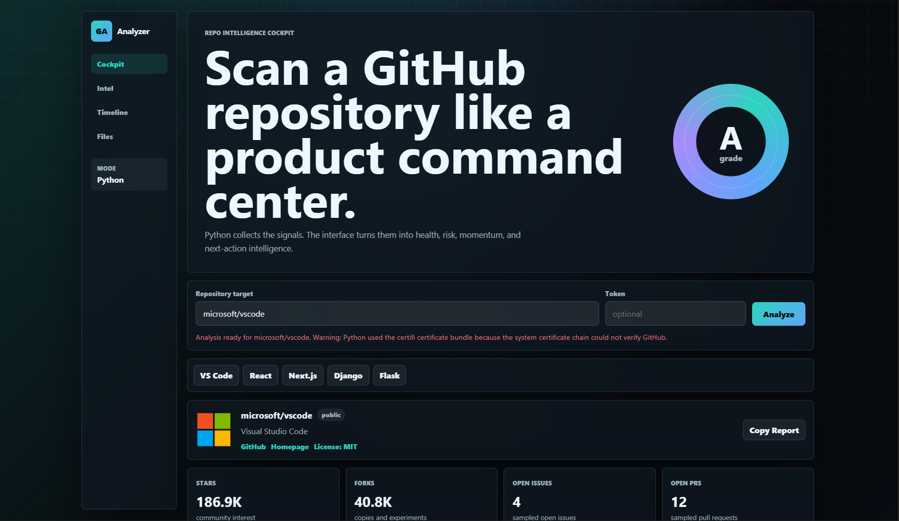
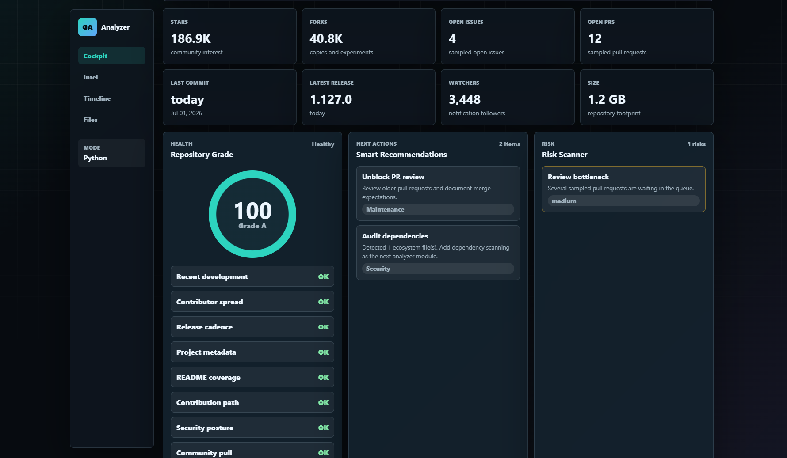
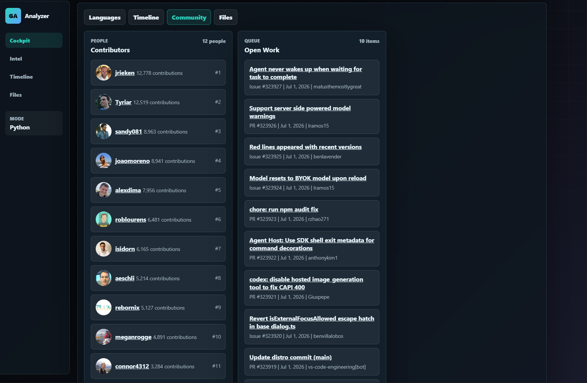
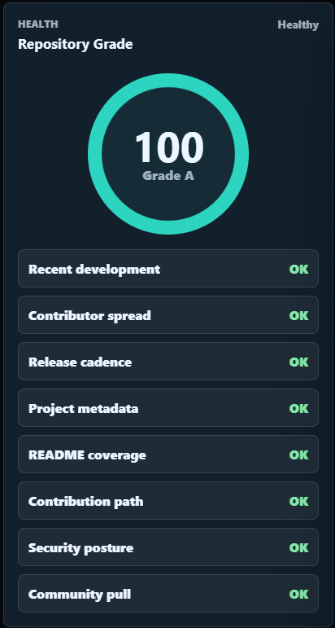

<div align="center">

# 🚀 GitHub Analyzer

### AI-Powered Repository Intelligence Dashboard

Analyze any GitHub repository with comprehensive insights, repository health metrics, risk analysis, contributor statistics, language breakdowns, and actionable recommendations.

<p align="center">


</p>

<p align="center">


</p>

---

# ✨ Overview

GitHub Analyzer is a **Python-powered repository intelligence platform** that transforms GitHub repository data into meaningful visual insights.

Instead of manually browsing repository pages, GitHub Analyzer generates an interactive dashboard containing repository health metrics, contributor analytics, release information, dependency detection, language statistics, and quality recommendations—all in one place.

The backend communicates securely with the **GitHub REST API**, while the frontend presents the information in an elegant and responsive interface.

---

# ⚡ Features

<table>
<tr>

<td width="50%">

### 📊 Repository Analytics

- Repository Overview
- Health Score & Letter Grade
- Language Distribution
- Repository Metadata
- Default Branch Analysis
- Stars, Forks & Watchers

</td>

<td width="50%">

### 🔍 Code Intelligence

- Dependency Detection
- Root File Explorer
- Recent Commits
- Release Timeline
- Contributor Ranking
- Repository Activity

</td>

</tr>

<tr>

<td>

### 🛡️ Quality Assessment

- Risk Scanner
- Repository Quality Signals
- Smart Recommendations
- Issue Analysis
- Pull Request Insights

</td>

<td>

### 🎨 User Experience

- Interactive Dashboard
- Responsive Design
- GitHub Token Support
- Copyable Reports
- Modern UI Components

</td>

</tr>

</table>

---

# 🖥️ Supported Repository Formats

GitHub Analyzer intelligently parses multiple repository formats.

```text
facebook/react

vercel/next.js

https://github.com/microsoft/vscode

git@github.com:django/django.git
```

---

# 🚀 Getting Started

## Clone Repository

```bash
git clone https://github.com/your-username/your-repo.git
```

```bash
cd your-repo
```

---

## Install Dependencies

```bash
pip install -r requirements.txt
```

---

## Run the Application

```powershell
python app.py
```

Open your browser:

```text
http://127.0.0.1:5173
```

---

# 🔐 GitHub Authentication

GitHub Analyzer works without authentication for public repositories.

For:

- Private repositories
- Higher API rate limits
- Organization repositories

Simply provide a GitHub Personal Access Token inside the application.

---

# 📈 Dashboard Modules

✅ Repository Overview

✅ Health Score

✅ Quality Indicators

✅ Repository Risks

✅ Smart Recommendations

✅ Dependency Detection

✅ Language Breakdown

✅ Contributor Analytics

✅ Commit History

✅ Release History

✅ Issue Analysis

✅ Pull Request Overview

✅ Root File Explorer

---

# 📊 Architecture

```text
                GitHub REST API
                      │
                      │
              Flask Backend (Python)
                      │
        Repository Processing Engine
                      │
          Dashboard & Analytics Layer
                      │
             Interactive Web UI
```

---

# 📸 Screenshots

| Dashboard | Analytics |
|-----------|-----------|
|  |  |

| Contributors | Repository Health |
|--------------|------------------|
|  |  |

---

# 🛣️ Roadmap

- ⭐ Recent Search History
- ⭐ Compare Two Repositories
- ⭐ Security & Vulnerability Analysis
- ⭐ Local Repository Scanner
- ⭐ AI-powered Recommendations
- ⭐ PDF Report Export
- ⭐ Markdown Report Export
- ⭐ Repository Timeline Visualization
- ⭐ Organization Analytics
- ⭐ Commit Heatmaps

---

# 🛠️ Tech Stack

| Technology | Purpose |
|------------|---------|
| Python | Backend Logic |
| Flask | API Server |
| GitHub REST API | Repository Data |
| HTML/CSS/JavaScript | Frontend |
| REST APIs | Data Communication |

---

# 🤝 Contributing

Contributions, ideas, and feature requests are always welcome!

1. Fork the repository
2. Create a feature branch
3. Commit your changes
4. Push the branch
5. Open a Pull Request

---

# ⭐ Support

If you found this project useful, consider giving it a **⭐ Star**.

It helps the project grow and motivates future improvements.

---

<div align="center">

### 🚀 Built with ❤️ using Python & Flask


</div>
